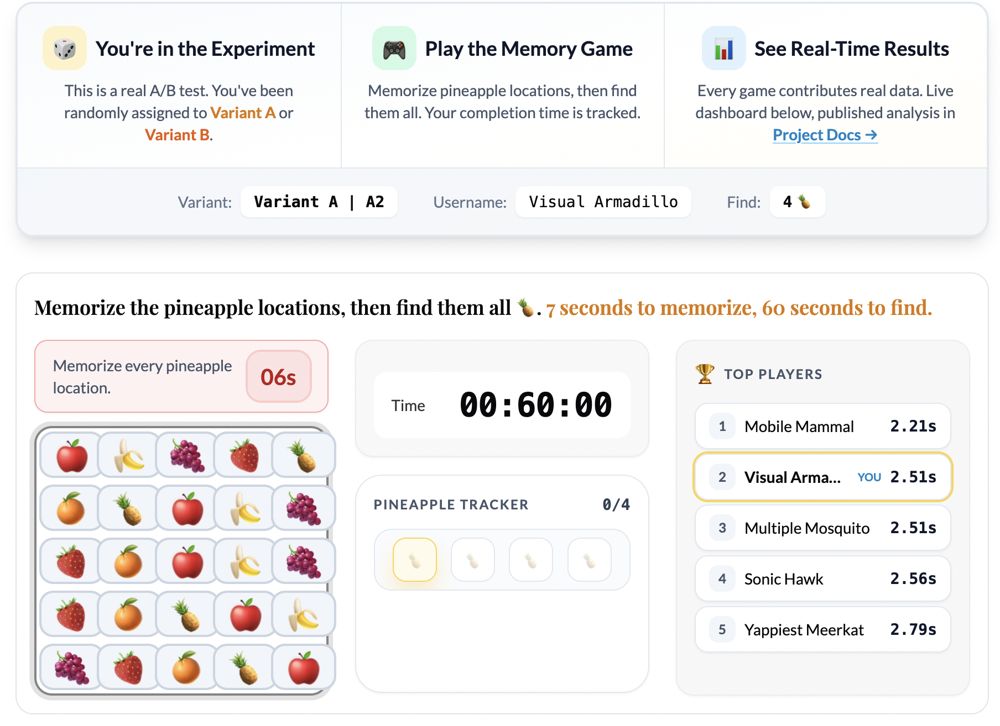
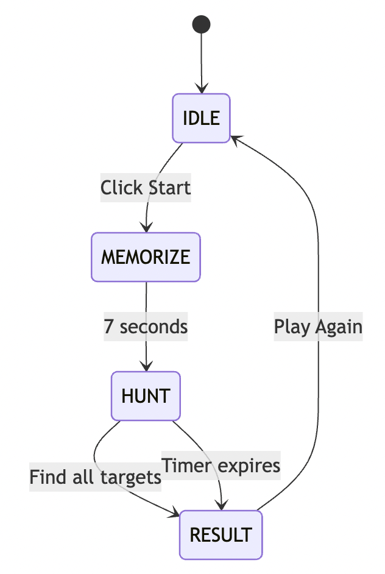
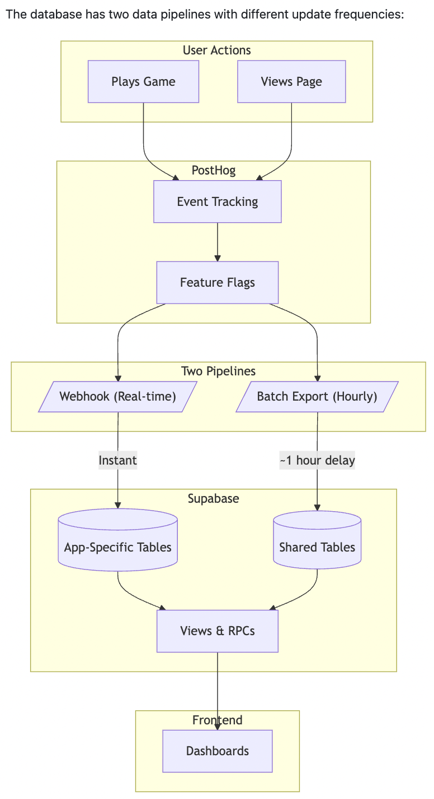
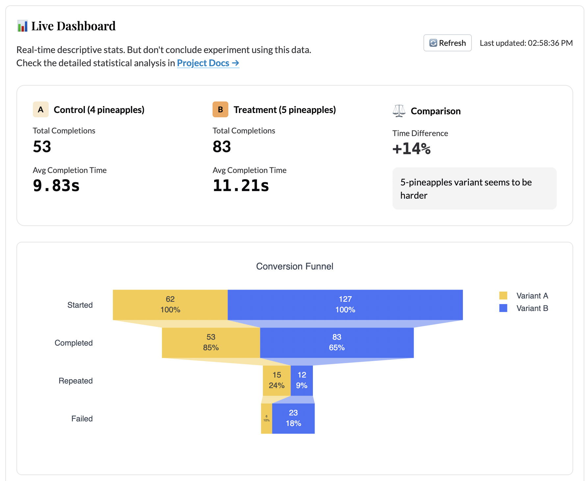
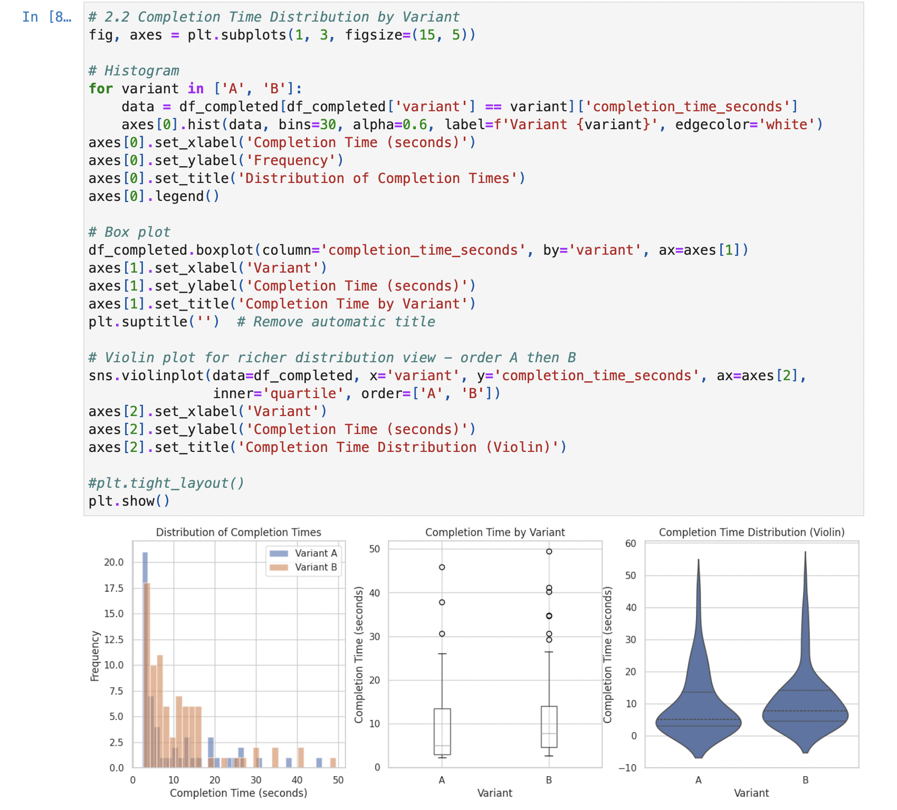

I run A/B tests for a living. I’ve had the privilege of uncovering causal effects of marketing, digital and other physical interventions on customer behavior and company profitability at a massive scale in my career. The science of experiment analysis is well established, but there are far more nuances in the design of experiments and methodological choices than you can imagine. In practice, experimentation is always messy. And most important, the interpretation of results and decisions you make from those results is what matters most. 

I can devote multiple posts on how methodological choices impact your results, and there are experts in this field ([Ron Kohavi](https://robotics.stanford.edu/~ronnyk/) etc.) with far more knowledge and experience than me, who you can read up on. This post, however, is more focused on all the work that goes into getting that dataset with groups A & B in front of data scientists, and how engineering, product, and UX choices not only affect the data but also the customer behavior effect itself that you are trying to measure. 

I built this personal data science lab to practice the full loop—designing a product, engineering the backend & frontend, wiring up analytics, acquiring users, and applying methods to tell a story from the data. The first app I built here is the [A/B Testing Memory Game](/ab-simulator/), a simple game where you memorize fruit positions and then hunt for hidden pineapples. Behind the scenes, it runs a real experiment studying how game difficulty affects player behavior. Every game played contributes data to a [published analysis](/projects/ab-simulator/) that anyone can explore.

This post walks through the full journey: why I built it, how the architecture works, what the data showed, and what I decided to ship (and not ship) based on the results.

## Why go through all this effort?

Most data scientists, myself included, spend their careers analyzing data that someone else collected. We inherit dashboards, inherit event schemas, inherit assumptions baked into pipelines years ago. We become skilled at querying and modeling, but we rarely experience the full loop: designing what to measure, instrumenting it correctly, watching real users interact with it, and then making product decisions based on what the data actually says. In my career, I’ve had the opportunity to wear all these hats - the engineer, the frontend designer, server administrator, product manager, data analyst, decision maker. It’s almost impossible to do all that in any large company or if you’re just coming out of school, so I thought it would be cool to build and demonstrate how the sausage is made. 

I have a very busy work day as a people leader, so it probably wasn’t possible for me to even think of doing any of this maybe a couple of years ago. But now, with access to very capable coding LLMs like Claude or Codex, that time barrier just went down. Even though AI writes most of the code for me, I won’t call all of this vibe-coded given the amount of time and effort I put in to planning work, making architectural choices, managing context windows, building evaluation workflows and documenting everything. I’ll write a future post on all this. 

## What the Game Actually Does

The game is simple by design. You see a 5x5 grid of fruit emojis for 7 seconds. Your job is to memorize where the **pineapples** are. Then the grid hides, and you have 60 seconds to click all the pineapple positions from memory.

The experiment tests one hypothesis: **does increasing the number of pineapples (from 4 to 5) change player behavior?**

When you load the game, PostHog's feature flag system randomly assigns you to one of two variants:
- **Variant A (Control):** Find 4 pineapples
- **Variant B (Treatment):** Find 5 pineapples

You can see which variant you’re in, and you’re assigned a random username so you can be part of a global leaderboard. Then you just play. And your game data flows into the analytics pipeline.

## The Architecture

I wanted the architecture to be production-grade, not a toy. Here is how it works:

### **Frontend** 
The game runs as vanilla JavaScript ES6 modules wrapped in an Astro page. No heavy frameworks for the game logic itself. The state machine handles four phases: `IDLE → MEMORIZE → HUNT → RESULT`. Tailwind CSS handles styling.

### **Analytics Capture** 
PostHog SDK captures every meaningful event: `puzzle_started`, `puzzle_completed`, `puzzle_failed`, `puzzle_repeated`. Each event includes the variant assignment, completion time, and a session ID.

### **Proxy Layer** 
A Cloudflare Worker at `api-v2.eeshans.com` proxies analytics requests. This bypasses ad blockers that would otherwise drop events and skew the data. I'm not big tech and there are no logins on this site, so don't worry—your data is safe and non-identifiable. 

### **Data Storage** 
Supabase PostgreSQL receives events through two paths:
1. **Webhook (real-time):** PostHog fires webhooks on every event, writing to `posthog_events` instantly
2. **Batch export (hourly):** PostHog's batch export writes to `posthog_batch_events` for durability

### **Live Stats Dashboard** 
PostgREST exposes SQL functions that the frontend dashboard calls. Plotly renders the charts: completion time distributions, conversion funnels, average times by variant. A Leaflet map shows geographic distribution of players.

### **Notebook Analysis** 
Jupyter notebooks in `/analytics/notebooks/ab-simulator/` run every 2 hours via GitHub Actions. They pull data from Supabase, run statistical tests, and output a YAML summary that displays on the [project hub page](/projects/ab-simulator/).

The whole pipeline is open-source. You can see exactly how events flow from a button click to a published statistical conclusion. You can read more about the [architecture in detail here](https://github.com/eeshansrivastava89/datascienceapps/blob/main/docs/ARCHITECTURE.md). 

## The Analysis Methodology

Building the game was only half the work. The other half was building an analysis system rigorous enough to actually trust the results. Here's what the methodology covers at a high level:

* **Primary Metric:** Completion time (seconds). This measures how long it takes users to successfully find all pineapples.
* **Guardrail Metrics:** Completion rate (did users finish?) and repeat rate (did they come back?). These protect against optimizing one metric at the expense of user experience.

**Statistical Tests:**
- Welch's t-test for completion time (handles unequal variances between groups)
- Chi-square test for completion rate (categorical outcome)
- Z-test for repeat rate (proportion comparison)
- Power analysis to determine required sample size for detecting meaningful effects

**Data Quality Checks:**
- Sample Ratio Mismatch (SRM) detection: If the 50/50 split drifts significantly, something is wrong with randomization or data collection
- Duplicate session detection: Users playing multiple times need to be handled correctly
- Confidence interval reporting: Point estimates are meaningless without uncertainty bounds

## The Live Dashboard

The [live dashboard](/ab-simulator/) updates in real-time as games are played. It shows:

- **Side-by-side comparison cards:** Average completion time and total completions per variant
- **Distribution chart:** Kernel density estimation (KDE) of completion times, overlaid by variant
- **Conversion funnel:** How many users start vs. complete the game
- **Recent completions table:** The last 50 games with individual stats
- **Geographic map:** Where players are located, colored by variant assignment

The dashboard polls Supabase via PostgREST RPCs with adaptive intervals: fast polling when users are active, slower when idle. This keeps the experience responsive without hammering the database.

## The Notebook Analysis

The Jupyter notebook in `/analytics/notebooks/ab-simulator/` runs every 2 hours via GitHub Actions and publishes results to the [project hub page](/projects/ab-simulator/). The notebook:

1. Pulls all event data from Supabase
2. Runs the full statistical test suite
3. Checks for data quality issues (SRM, duplicates, outliers)
4. Calculates observed power and required sample size
5. Generates a YAML summary with a status (`significant`, `inconclusive`, or `insufficient_data`) and a recommendation

Even with limited test data, the analysis code is already robust enough to detect issues. During testing, I intentionally introduced imbalanced data to verify the SRM detection works. I simulated underpowered scenarios to confirm the power analysis correctly flags insufficient sample sizes. The infrastructure is ready. It just needs real users.

## What Happens Next

As users play the game, data accumulates. The scheduled notebook runs will show:
- Whether the effect size stabilizes or changes
- When (or if) we reach statistical significance
- Whether the guardrail metrics raise concerns
- The precise sample size needed to make a confident decision

The experiment hypothesis is simple: **does adding one more pineapple (5 instead of 4) change how players behave?** But the infrastructure to answer that question rigorously is not simple. That infrastructure is now live and waiting for data.

## The Full Loop

This project represents what I mean by **"0→1 Data Science."** I started with a concept, built a working app, wired up a production analytics pipeline, designed a rigorous analysis methodology, and published everything for anyone to explore.

The experiment is now live. Every game played contributes real data. The dashboard updates in real-time. The notebook analysis runs on a schedule (currently every 2 hours). And eventually, the data will tell us whether to ship the harder variant or not.

If you want to contribute data, [play the game](/ab-simulator/). If you want to see the analysis notebook, check the [project hub](/projects/ab-simulator/). If you want to build something similar, the entire codebase is [on GitHub](https://github.com/eeshansrivastava89/datascienceapps).

---

*This post is part of the [A/B Testing Memory Game](/projects/ab-simulator/) project. The game is live and collecting data. The analysis runs every 2 hours and publishes automatically. I will write a follow-up post once we have enough data to draw conclusions.*
